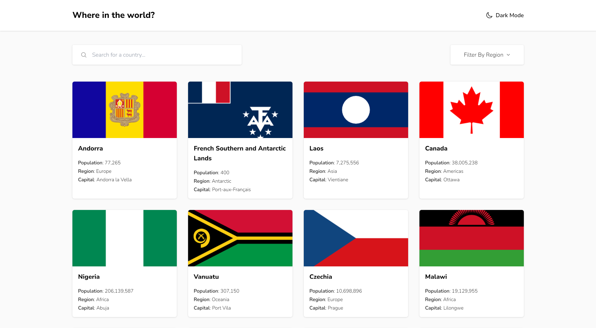

# Frontend Mentor - REST Countries API with color theme switcher solution

This is a solution to the [REST Countries API with color theme switcher challenge on Frontend Mentor](https://www.frontendmentor.io/challenges/rest-countries-api-with-color-theme-switcher-5cacc469fec04111f7b848ca). Frontend Mentor challenges help you improve your coding skills by building realistic projects.

## Table of contents

- [Overview](#overview)
  - [The challenge](#the-challenge)
  - [Screenshot](#screenshot)
  - [Links](#links)
- [My process](#my-process)
  - [Built with](#built-with)
  - [What I learned](#what-i-learned)
- [Author](#author)

## Overview

### The challenge

Users should be able to:

- See all countries from the API on the homepage
- Search for a country using an `input` field
- Filter countries by region
- Click on a country to see more detailed information on a separate page
- Click through to the border countries on the detail page
- Toggle the color scheme between light and dark mode _(optional)_

### Screenshot



### Links

- Solution URL: [https://github.com/KH-Ray/rest-countries-api-with-color-theme-switcher](https://github.com/KH-Ray/rest-countries-api-with-color-theme-switcher)
- Live Site URL: [https://startling-cranachan-760ce0.netlify.app/](https://startling-cranachan-760ce0.netlify.app/)

## My process

### Built with

- Semantic HTML5 markup
- CSS custom properties
- Flexbox
- CSS Grid
- [React](https://reactjs.org/) - JS library
- [Tailwind](https://tailwindcss.com/) - A utility-first CSS framework

### What I learned

```jsx
const App = () => {
  const [countries, setCountries] = useState([]);
  const [isLoading, setIsLoading] = useState(false);
  const [darkMode, setDarkMode] = useState(false);

  useEffect(() => {
    const getRestCountriesAPI = async () => {
      setIsLoading(true);

      try {
        const countries = await getAllCountries();
        setCountries(countries);
      } catch (error) {
        console.error(error);
      }

      setIsLoading(false);
    };

    getRestCountriesAPI();
  }, []);

  return (
    <Router>
      <main className="max-h-full min-h-screen overflow-auto font-nunito-sans">
        <header
          className={classNames(
            darkMode ? "bg-dark-blue text-white" : "bg-white text-black",
            "drop-shadow",
          )}
        >
          <div className="mx-auto flex w-11/12 max-w-7xl justify-between py-7">
            <div className="text-sm font-extrabold sm:text-2xl">
              Where in the world?
            </div>
            <div
              onClick={() => setDarkMode(!darkMode)}
              className="flex cursor-pointer items-center gap-2 text-sm font-semibold sm:text-base"
            >
              <Moon
                className={classNames(
                  darkMode ? "fill-white" : "fill-none",
                  "h-5 w-5",
                )}
              />
              Dark Mode
            </div>
          </div>
        </header>

        <Routes>
          <Route
            path="/"
            element={
              <AllCountries
                isLoading={isLoading}
                countries={countries}
                darkMode={darkMode}
              />
            }
          />
          <Route
            path="/:id"
            element={
              <SelectedCountry
                isLoading={isLoading}
                countries={countries}
                darkMode={darkMode}
              />
            }
          />
        </Routes>
      </main>
    </Router>
  );
};
```

## Author

- Frontend Mentor - [@KH-Ray](https://www.frontendmentor.io/profile/KH-Ray)
